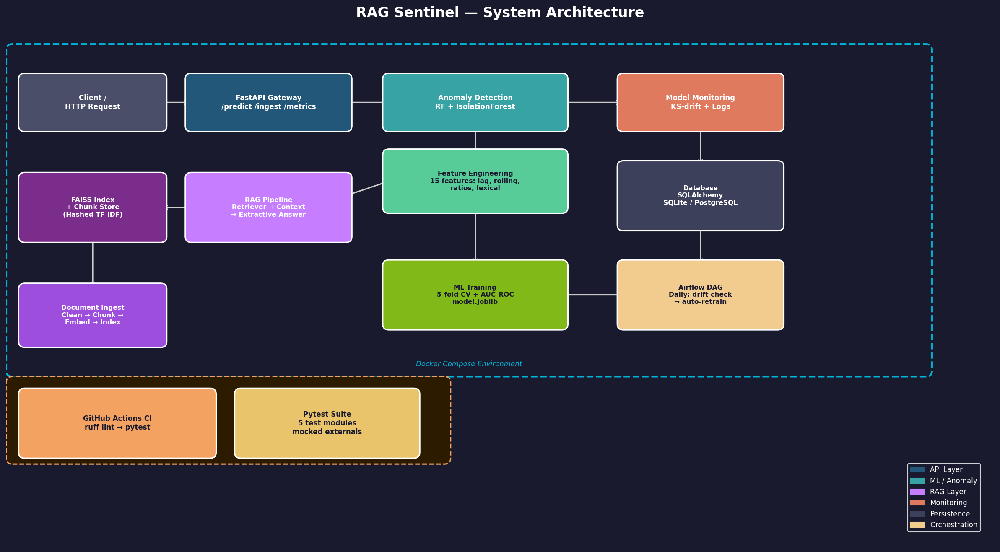

# RAG Sentinel

**RAG-powered document intelligence with ML anomaly detection and drift monitoring.**

Inspired by [HKUDS/RAG-Anything](https://github.com/HKUDS/RAG-Anything) — trending on GitHub.

RAG Sentinel combines Retrieval-Augmented Generation (RAG) with real-time query anomaly detection. Every incoming query is scored by an ensemble ML model (RandomForest + IsolationForest) for adversarial patterns (SQL injection, prompt injection, abnormally-long inputs) before being answered from your document corpus. Prediction logs feed a KS-test drift monitor, and an Airflow DAG triggers automated retraining when score distributions shift.

---

## Architecture



---

## Tech Stack

| Layer | Technology |
|---|---|
| API | FastAPI (Python 3.11) |
| ML | RandomForest + IsolationForest ensemble |
| Pipeline | sklearn Pipeline, 5-fold CV, AUC-ROC |
| RAG | FAISS (optional) + hashed TF-IDF embedding |
| Monitoring | KS-drift test + SQLAlchemy prediction logs |
| Orchestration | Airflow DAG (daily retrain) |
| Persistence | SQLite (dev) / PostgreSQL (prod) |
| Infra | Docker + docker-compose |
| CI | GitHub Actions (ruff + pytest) |

---

## Quickstart

```bash
cp .env.example .env
pip install -r requirements.txt
uvicorn app.main:app --reload
```

### Docker

```bash
docker-compose up --build
```

---

## API Endpoints

### `POST /predict`
Score a query for anomalies and optionally retrieve a RAG answer.

```json
{
  "query": "What is transfer learning?",
  "use_rag": true,
  "top_k": 3
}
```

**Response:**
```json
{
  "is_anomaly": false,
  "anomaly_score": 0.08,
  "classifier_prob": 0.04,
  "isolation_score": 0.21,
  "rag_answer": "Transfer learning is...",
  "rag_sources": [{"doc_id": "doc1", "score": 0.87, "excerpt": "..."}],
  "response_time_ms": 14.2
}
```

### `POST /ingest`
Add a document to the RAG index.

```json
{"text": "Full document text...", "doc_id": "my-doc-001", "filename": "paper.txt"}
```

### `GET /metrics`
System health, anomaly rates, and drift statistics.

### `GET /health`
Liveness probe.

### `POST /retrain`
Trigger model retraining on demand.

---

## Feature Engineering (15 features)

| Feature | Description |
|---|---|
| `char_len` | Total character count |
| `word_count` | Total word count |
| `lexical_diversity` | Unique words / total words |
| `avg_word_len` | Mean word length |
| `punct_ratio` | Punctuation density |
| `digit_ratio` | Digit density |
| `upper_ratio` | Uppercase density |
| `special_ratio` | Special character ratio |
| `len_lag1_ratio` | Length vs previous query |
| `len_lag2_ratio` | Length vs 2-back query |
| `rolling_mean_len` | 5-query rolling mean length |
| `rolling_std_len` | 5-query rolling std of length |
| `len_deviation` | Deviation from rolling mean |
| `sql_keywords` | SQL/XSS keyword count |
| `code_pattern` | Bracket/code character count |

---

## Model Monitoring & Drift

RAG Sentinel logs every prediction to the database and runs a **Kolmogorov-Smirnov test** between reference and current anomaly score distributions. Drift triggers automatic retraining via the Airflow DAG (`pipelines/retrain_dag.py`).

---

## Testing

```bash
pytest tests/ -q
```

38 tests across 4 modules:
- `test_features.py` — feature extraction correctness
- `test_model.py` — training, cross-validation, prediction
- `test_monitoring.py` — drift detection, DB logging
- `test_api.py` — all API endpoints (mocked DB)

---

## Project Structure

```
rag-sentinel/
├── app/
│   ├── main.py          # FastAPI app (5 endpoints)
│   ├── model.py         # RF + IsolationForest ensemble, 5-fold CV
│   ├── features.py      # 15-feature engineering pipeline
│   ├── monitoring.py    # KS-drift test + prediction logging
│   └── database.py      # SQLAlchemy models (SQLite/PostgreSQL)
├── rag/
│   ├── ingest.py        # Chunking + embedding + index population
│   ├── index.py         # FAISS/numpy similarity index
│   └── retriever.py     # Top-k retrieval + extractive answer
├── pipelines/
│   └── retrain_dag.py   # Airflow DAG: drift check → retrain
├── tests/               # pytest suite (38 tests)
├── scripts/
│   └── generate_diagram.py
├── screenshots/
│   └── architecture.png
├── .github/workflows/ci.yml
├── Dockerfile
├── docker-compose.yml
├── requirements.txt
└── .env.example
```
