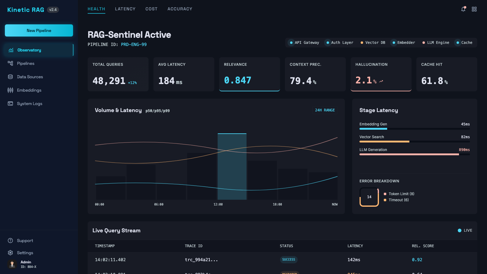
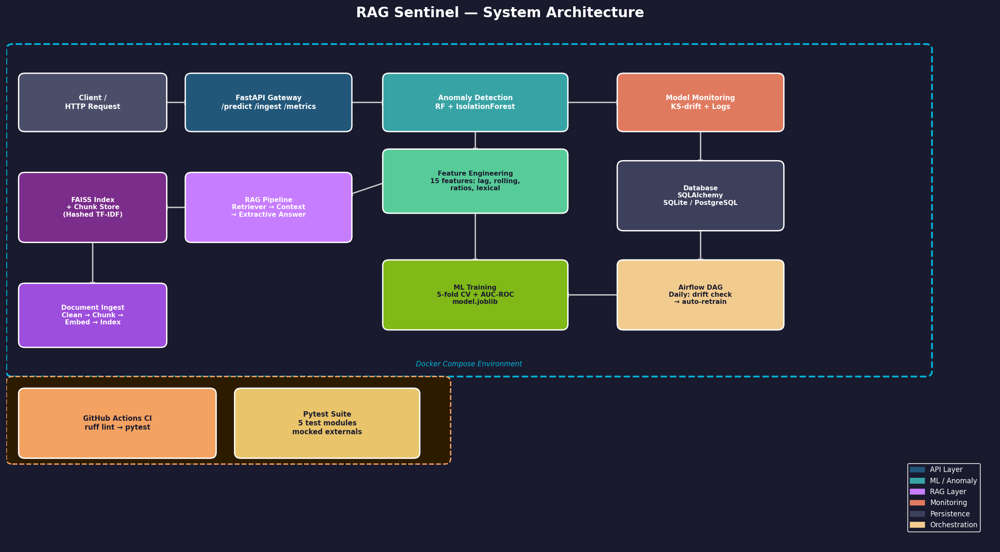

  

# RAG Sentinel

**RAG-powered document intelligence with ML anomaly detection and drift monitoring.**

Inspired by [HKUDS/RAG-Anything](https://github.com/HKUDS/RAG-Anything) — trending on GitHub.

RAG Sentinel combines Retrieval-Augmented Generation (RAG) with real-time query anomaly detection. Every incoming query is scored by an ensemble ML model (RandomForest + IsolationForest) for adversarial patterns (SQL injection, prompt injection, abnormally-long inputs) before being answered from your document corpus. Prediction logs feed a KS-test drift monitor, and an Airflow DAG triggers automated retraining when score distributions shift.

---

## Dashboard UI



A fully interactive RAG pipeline monitoring dashboard — built with Google Stitch (Gemini 3.1 Pro), Space Grotesk + Inter, and Tailwind CSS.

**Features:** Pipeline health strip · Total queries · Avg latency · Relevance score · Context precision · Hallucination rate · Cache hit · Volume & latency chart · Stage breakdown · Error donut · Live query stream

```bash
# Open the dashboard locally
open index.html

# Or serve it
python3 -m http.server 8081
```

> `index.html` — Stitch-generated UI &nbsp;|&nbsp; `index-chartjs.html` — Chart.js version

---

## Architecture



---

## Tech Stack

| Layer | Technology |
|---|---|
| API | FastAPI (Python 3.11) |
| ML | RandomForest + IsolationForest ensemble |
| Pipeline | sklearn Pipeline, 5-fold CV, AUC-ROC |
| RAG | FAISS (optional) + hashed TF-IDF embedding |
| Monitoring | KS-drift test + SQLAlchemy prediction logs |
| Orchestration | Airflow DAG (daily retrain) |
| Persistence | SQLite (dev) / PostgreSQL (prod) |
| Infra | Docker + docker-compose |
| CI | GitHub Actions (ruff + pytest) |

---

## Quickstart

```bash
cp .env.example .env
pip install -r requirements.txt
uvicorn app.main:app --reload
```

### Docker

```bash
docker-compose up --build
```

---

## API Endpoints

### `POST /predict`
Score a query for anomalies and optionally retrieve a RAG answer.

```json
{
  "query": "What is transfer learning?",
  "use_rag": true,
  "top_k": 3
}
```

**Response:**
```json
{
  "is_anomaly": false,
  "anomaly_score": 0.08,
  "classifier_prob": 0.04,
  "isolation_score": 0.21,
  "rag_answer": "Transfer learning is...",
  "rag_sources": [{"doc_id": "doc1", "score": 0.87, "excerpt": "..."}],
  "response_time_ms": 14.2
}
```

### `POST /ingest`
Add a document to the RAG index.

```json
{"text": "Full document text...", "doc_id": "my-doc-001", "filename": "paper.txt"}
```

### `GET /metrics`
System health, anomaly rates, and drift statistics.

### `GET /health`
Liveness probe.

### `POST /retrain`
Trigger model retraining on demand.

---

## Feature Engineering (15 features)

| Feature | Description |
|---|---|
| `char_len` | Total character count |
| `word_count` | Total word count |
| `lexical_diversity` | Unique words / total words |
| `avg_word_len` | Mean word length |
| `punct_ratio` | Punctuation density |
| `digit_ratio` | Digit density |
| `upper_ratio` | Uppercase density |
| `special_ratio` | Special character ratio |
| `len_lag1_ratio` | Length vs previous query |
| `len_lag2_ratio` | Length vs 2-back query |
| `rolling_mean_len` | 5-query rolling mean length |
| `rolling_std_len` | 5-query rolling std of length |
| `len_deviation` | Deviation from rolling mean |
| `sql_keywords` | SQL/XSS keyword count |
| `code_pattern` | Bracket/code character count |

---

## Model Monitoring & Drift

RAG Sentinel logs every prediction to the database and runs a **Kolmogorov-Smirnov test** between reference and current anomaly score distributions. Drift triggers automatic retraining via the Airflow DAG (`pipelines/retrain_dag.py`).

---

## Testing

```bash
pytest tests/ -q
```

38 tests across 4 modules:
- `test_features.py` — feature extraction correctness
- `test_model.py` — training, cross-validation, prediction
- `test_monitoring.py` — drift detection, DB logging
- `test_api.py` — all API endpoints (mocked DB)

---

## Project Structure

```
rag-sentinel/
├── app/
│   ├── main.py          # FastAPI app (5 endpoints)
│   ├── model.py         # RF + IsolationForest ensemble, 5-fold CV
│   ├── features.py      # 15-feature engineering pipeline
│   ├── monitoring.py    # KS-drift test + prediction logging
│   └── database.py      # SQLAlchemy models (SQLite/PostgreSQL)
├── rag/
│   ├── ingest.py        # Chunking + embedding + index population
│   ├── index.py         # FAISS/numpy similarity index
│   └── retriever.py     # Top-k retrieval + extractive answer
├── pipelines/
│   └── retrain_dag.py   # Airflow DAG: drift check → retrain
├── tests/               # pytest suite (38 tests)
├── scripts/
│   └── generate_diagram.py
├── screenshots/
│   └── architecture.png
├── .github/workflows/ci.yml
├── Dockerfile
├── docker-compose.yml
├── requirements.txt
└── .env.example
```
---

## Quick Start

```bash
# 1. Clone and install
git clone https://github.com/atharvadevne123/Rag-Sentinel.git
cd Rag-Sentinel
pip install -r requirements.txt

# 2. Configure (copy defaults)
cp .env.example .env

# 3. Start the API
uvicorn app.main:app --reload --port 8000

# Or with Docker
docker-compose up --build
```

The API will be available at `http://localhost:8000` and Swagger docs at `http://localhost:8000/docs`.

---

## API Reference

| Method | Endpoint | Description |
|--------|----------|-------------|
| `GET`  | `/health` | Liveness check — model loaded status |
| `GET`  | `/version` | Current application version string |
| `POST` | `/predict` | Score a query for anomaly patterns + optional RAG answer |
| `POST` | `/ingest` | Add a document to the RAG index |
| `GET`  | `/metrics` | System metrics, anomaly rate, and drift state |
| `POST` | `/retrain` | Trigger in-process model retraining |

### `/predict` Request Body

```json
{
  "query": "What is machine learning?",
  "use_rag": true,
  "top_k": 3
}
```

### `/ingest` Request Body

```json
{
  "text": "Machine learning is a branch of AI...",
  "doc_id": "my_document_001",
  "filename": "intro_to_ml.txt"
}
```

---

## Testing

```bash
# Install test dependencies
pip install pytest pytest-asyncio httpx

# Run all tests
pytest tests/ -v --tb=short

# Or via Make
make test
```

The test suite has 104+ tests across 9 modules covering:
- API endpoints (happy path + edge cases)
- Model training, cross-validation, and prediction
- Feature engineering (parametrized)
- Drift monitoring and KS-test
- RAG index, ingestion, and retrieval
- Airflow pipeline functions

---

## Configuration

Copy `.env.example` to `.env` and adjust:

| Variable | Default | Description |
|----------|---------|-------------|
| `DATABASE_URL` | `sqlite:///./rag_sentinel.db` | SQLAlchemy connection string |
| `MODEL_PATH` | `model.joblib` | Path to persisted model bundle |
| `METRICS_PATH` | `metrics.json` | Path to training metrics JSON |
| `FAISS_INDEX_PATH` | `rag_index.faiss` | Path to FAISS index file |
| `CHUNK_SIZE` | `128` | Words per document chunk |
| `CHUNK_OVERLAP` | `16` | Overlapping words between chunks |
| `LOG_LEVEL` | `INFO` | Python logging level |

---

## Contributing

Contributions are welcome! See [CONTRIBUTING.md](CONTRIBUTING.md) for the development workflow, code style guide, and PR checklist.

Please read our [Code of Conduct](CODE_OF_CONDUCT.md) before opening issues or pull requests.

---

## License

MIT — see [LICENSE](LICENSE) for details.

---

## Changelog

See [CHANGELOG.md](CHANGELOG.md) for a full history of changes and version notes.
